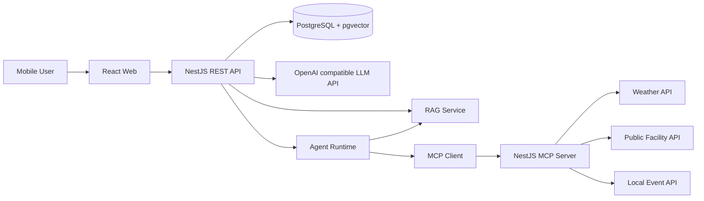
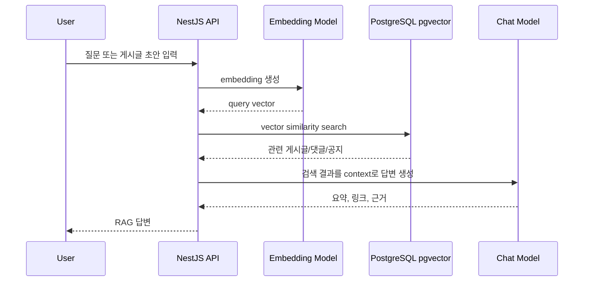
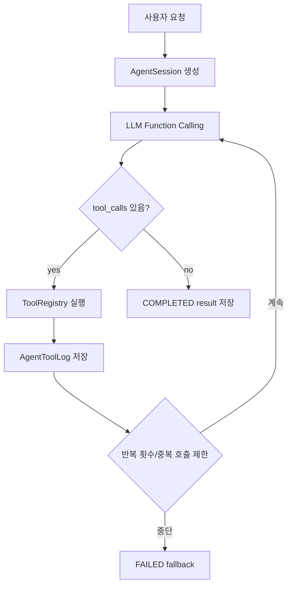
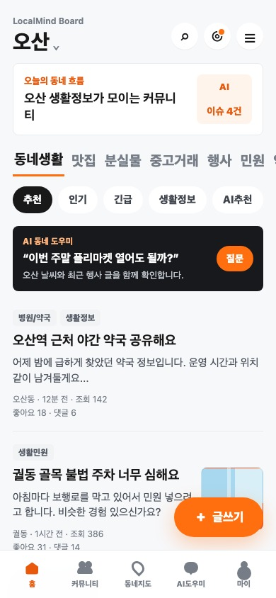

# LocalMind Board

LocalMind Board는 오산 지역 주민들이 동네 생활 정보를 공유하는 모바일 우선 지역 커뮤니티 게시판입니다. 맛집 추천, 분실물, 중고거래, 동네 행사, 생활 민원, 병원/약국/주차장 정보, 반려동물/육아 정보를 게시글과 댓글로 축적하고, 이 데이터를 RAG, MCP, AI Agent 기능의 지식 기반으로 활용합니다.

MVP 기본 지역은 `오산`입니다. 단, `regions` 테이블은 `경기도 > 오산시 > 동` 형태의 계층 구조로 설계해 다른 지역으로 확장할 수 있습니다.

## 주요 구현 기능

- React 모바일 우선 반응형 프론트엔드
- JWT 기반 회원가입, 로그인, 내 정보 조회
- 게시글 CRUD, 댓글 CRUD, 태그, 카테고리, 페이징, 검색
- 게시글 좋아요, 지역 필터링
- PostgreSQL + Prisma + pgvector 기반 벡터 저장소
- 게시글, 댓글, 공지 데이터를 벡터화하는 RAG 구조
- 유사 게시글 추천, 중복 게시글 확인, 동네 Q&A, 지역 이슈 요약 API
- JSON-RPC 기반 MCP Server 직접 구현
- MCP Tool: `get_weather_by_region`, `search_public_facility`, `get_local_event_info`
- Function Calling 기반 AI Agent 추론 루프
- Agent 도구 호출 로그와 세션 상태 저장
- Swagger API 문서화
- 이미지 첨부는 MVP 이후 선택 기능으로 분리

## 전체 아키텍처



역할은 세 앱으로 나뉩니다.

- `apps/web`: React + Vite 모바일 웹
- `apps/api`: NestJS REST API, 인증, 게시판, RAG, Agent, MCP Client
- `apps/mcp-server`: JSON-RPC MCP Server와 외부 데이터 Tool

## 디렉토리 구조

```text
.
├── apps
│   ├── api                 # NestJS REST API
│   ├── mcp-server          # JSON-RPC MCP Server
│   └── web                 # React 모바일 프론트엔드
├── docs
│   ├── architecture.md
│   ├── api-examples.md
│   ├── demo-scenario.md
│   └── screenshots
├── infra
│   ├── docker-compose.yml
│   └── postgres/init.sql   # pgvector extension 활성화
├── packages/shared
├── prisma
│   ├── migrations
│   ├── schema.prisma
│   └── seed.ts
└── README.md
```

## NestJS 모듈 구조

API 서버:

```text
AppModule
├── PrismaModule
├── AuthModule
├── UsersModule
├── RegionsModule
├── CategoriesModule
├── PostsModule
├── CommentsModule
├── TagsModule
├── LikesModule
├── SearchModule
├── AiModule
├── RagModule
├── McpClientModule
└── AgentModule
```

MCP 서버:

```text
AppModule
├── JsonRpcModule
├── ToolsModule
├── WeatherModule
├── PublicFacilityModule
└── LocalEventModule
```

## DB 테이블 설계

| 테이블 | 역할 |
| --- | --- |
| `users` | 회원, JWT subject, 기본 지역 |
| `regions` | 지역 계층 구조, 오산 기본값과 동 단위 확장 |
| `categories` | 맛집, 분실물, 중고거래, 동네행사 등 |
| `posts` | 게시글 본문, 지역, 카테고리, 조회수, 상태 |
| `comments` | 게시글 댓글 |
| `tags` | 태그 마스터 |
| `post_tags` | 게시글-태그 다대다 연결 |
| `post_likes` | 게시글 좋아요 |
| `notices` | 공지와 운영 안내 |
| `embeddings` | `POST`, `COMMENT`, `NOTICE` 벡터 데이터 |
| `agent_sessions` | Agent 실행 상태와 결과 |
| `agent_tool_logs` | Agent 도구 호출 로그 |
| `mcp_tool_logs` | MCP Tool 호출 로그 |

`embeddings.embedding`은 `vector(1536)` 타입입니다. 기본 embedding 모델은 `.env`의 `EMBEDDING_MODEL=text-embedding-3-small`을 기준으로 합니다.

## Prisma Schema 핵심

전체 스키마는 [prisma/schema.prisma](./prisma/schema.prisma)에 있습니다. 핵심 관계는 다음과 같습니다.

```text
User 1:N Post
User 1:N Comment
Region 1:N Post
Category 1:N Post
Post 1:N Comment
Post N:M Tag through PostTag
Post N:M User through PostLike
Region 1:N Embedding
AgentSession 1:N AgentToolLog
```

## 주요 API 엔드포인트

Swagger 문서는 서버 실행 후 `http://localhost:3000/api/docs`에서 확인할 수 있습니다.

| 기능 | Method | Endpoint |
| --- | --- | --- |
| 회원가입 | `POST` | `/api/auth/signup` |
| 로그인 | `POST` | `/api/auth/login` |
| 내 정보 | `GET` | `/api/auth/me` |
| 지역 목록 | `GET` | `/api/regions` |
| 기본 지역 | `GET` | `/api/regions/default` |
| 내 지역 변경 | `PATCH` | `/api/users/me/region` |
| 카테고리 | `GET` | `/api/categories` |
| 태그 | `GET` | `/api/tags` |
| 게시글 목록 | `GET` | `/api/posts?page=1&limit=10&regionId=...&categoryId=...` |
| 게시글 작성 | `POST` | `/api/posts` |
| 게시글 상세 | `GET` | `/api/posts/:id` |
| 게시글 수정 | `PATCH` | `/api/posts/:id` |
| 게시글 삭제 | `DELETE` | `/api/posts/:id` |
| 좋아요 | `POST` | `/api/posts/:id/like` |
| 좋아요 취소 | `DELETE` | `/api/posts/:id/like` |
| 댓글 목록 | `GET` | `/api/posts/:postId/comments` |
| 댓글 작성 | `POST` | `/api/posts/:postId/comments` |
| 댓글 수정 | `PATCH` | `/api/comments/:id` |
| 댓글 삭제 | `DELETE` | `/api/comments/:id` |
| 게시글 검색 | `GET` | `/api/search/posts?q=야간약국` |
| RAG 질문 | `POST` | `/api/rag/ask` |
| 유사 게시글 | `POST` | `/api/rag/similar-posts` |
| 중복 확인 | `POST` | `/api/rag/duplicate-check` |
| 지역 이슈 요약 | `GET` | `/api/rag/regional-issues` |
| Agent 글쓰기 | `POST` | `/api/agent/post-helper` |
| Agent 민원 작성 | `POST` | `/api/agent/complaint-helper` |
| Agent 태그 추천 | `POST` | `/api/agent/tag-suggestion` |
| Agent 중복 확인 | `POST` | `/api/agent/duplicate-check` |
| MCP JSON-RPC | `POST` | `http://localhost:3010/rpc` |

## RAG 처리 흐름



구현 포인트:

- 게시글/댓글 작성, 수정, 삭제 시 `RagIngestionService`가 embedding을 upsert/delete합니다.
- `VectorSearchService`는 pgvector 거리 연산으로 유사 문서를 조회합니다.
- OpenAI API Key가 없으면 ingestion은 실패로 전체 요청을 막지 않고 건너뜁니다.
- `OPENAI_API_KEY`가 설정된 상태에서 `npm run prisma:seed`를 실행하면 데모 공지와 샘플 게시글 embedding도 함께 생성합니다.
- 사용자가 지역을 넘기지 않으면 `DEFAULT_REGION_CODE=OSAN` 기준으로 검색합니다.

MVP RAG 기능:

- 유사 게시글 추천: 글 작성 전 비슷한 과거 글 제공
- 중복 게시글 방지: 같은 주제의 기존 글과 유사도 기반 경고
- 동네 Q&A 봇: “근처 야간 약국 어디 있어?” 같은 질문에 관련 글과 요약 제공
- 최근 지역 이슈 요약: 특정 기간의 지역 글을 검색해 이슈 흐름 요약

## MCP Server 처리 흐름

MCP Server는 독립 NestJS 앱이며 JSON-RPC 2.0 스타일의 `POST /rpc` 요청을 받습니다.

```json
{
  "jsonrpc": "2.0",
  "id": "weather-1",
  "method": "tools/call",
  "params": {
    "name": "get_weather_by_region",
    "arguments": {
      "region": "오산",
      "date": "2026-06-13"
    }
  }
}
```

처리 흐름:

```text
API Agent 또는 사용자 요청
-> McpClientService
-> MCP Server /rpc
-> ToolsService
-> Weather/PublicFacility/LocalEvent Service
-> 외부 API 또는 mock fallback
-> JSON-RPC result
```

MVP에서는 API Key 없이도 발표가 가능하도록 mock fallback 데이터를 제공합니다. 실제 서비스로 바꿀 때는 `.env`의 `WEATHER_API_KEY`, `PUBLIC_DATA_API_KEY`, `MAP_API_KEY`를 사용해 각 서비스 내부 호출부를 교체하면 됩니다.

## AI Agent 추론 루프

Agent는 사용자의 요청을 보고 필요한 도구를 선택해 실행하는 구조입니다. LangGraph의 상태 기반 루프를 참고하되 NestJS 서비스로 단순화했습니다.



설계 조건:

- Function Calling 사용
- `AgentSession.state`로 메시지, 반복 횟수, 도구 호출 상태 관리
- 최대 반복 횟수 제한
- 동일 도구/동일 입력 반복 방지
- 도구 호출 로그 저장
- MCP 오류, LLM API 오류, 환경변수 누락을 `FAILED` 상태로 정리
- RAG 검색이 필요하면 vector search 도구 호출
- 외부 데이터가 필요하면 MCP Tool 호출

MVP Agent:

- 지역 생활 글 작성 도우미
- 민원 글 작성 도우미
- 게시글 자동 태그 추천
- 중복 게시글 확인

## 프론트엔드 디자인

모바일을 기본 화면으로 설계했습니다. 당근 스타일의 지역 커뮤니티 정보 구조를 참고하되, LocalMind Board 전용 색상과 문구를 사용했습니다.

- 기본 지역: 오산
- 상단 지역 표시와 검색/알림 버튼
- 카테고리 탭과 필터 칩
- 게시글 리스트: 카테고리, 제목, 요약, 동, 조회수, 좋아요, 댓글
- 하단 탭바: 홈, 커뮤니티, 동네지도, AI도우미, 마이
- 모바일 고정 글쓰기 버튼
- 태블릿/데스크톱에서는 중앙 컨텐츠 폭 확장

스크린샷:



## 환경변수

`.env.example`을 복사해 `.env`를 만듭니다.

```bash
cp .env.example .env
```

주요 변수:

| 변수 | 설명 |
| --- | --- |
| `DATABASE_URL` | PostgreSQL 연결 문자열 |
| `JWT_SECRET` | JWT 서명 키 |
| `JWT_EXPIRES_IN` | Access Token 만료 시간 |
| `OPENAI_API_KEY` | LLM/Embedding API Key |
| `OPENAI_BASE_URL` | OpenAI 호환 API base URL |
| `LLM_MODEL` | Chat/Function Calling 모델 |
| `EMBEDDING_MODEL` | Embedding 모델 |
| `EMBEDDING_DIM` | pgvector 차원 |
| `API_PORT` | API 서버 포트, 기본 3000 |
| `WEB_PORT` | Web 서버 포트, 기본 5173 |
| `MCP_SERVER_PORT` | MCP 서버 포트, 기본 3010 |
| `MCP_SERVER_URL` | API 서버에서 호출할 MCP RPC URL |
| `CORS_ORIGIN` | Web origin |
| `DEFAULT_REGION_CODE` | 기본 지역 코드, MVP는 `OSAN` |
| `WEATHER_API_KEY` | 날씨 API Key |
| `PUBLIC_DATA_API_KEY` | 공공데이터 API Key |
| `MAP_API_KEY` | 지도/장소 API Key |

## 실행 방법

Node.js와 Docker가 필요합니다.

```bash
npm install
cp .env.example .env
docker compose -f infra/docker-compose.yml up -d
npm run prisma:generate
npm run prisma:migrate
npm run prisma:seed
npm run dev
```

RAG 데모까지 바로 확인하려면 `.env`에 `OPENAI_API_KEY`를 넣은 뒤 `npm run prisma:seed`를 실행합니다. 키가 없으면 seed는 지역, 카테고리, 공지, 데모 사용자, 샘플 게시글만 만들고 embedding 생성은 건너뜁니다.

개별 실행:

```bash
npm run dev:api
npm run dev:mcp
npm run dev:web
```

접속 주소:

- Web: `http://localhost:5173`
- API: `http://localhost:3000/api`
- Swagger: `http://localhost:3000/api/docs`
- MCP RPC: `http://localhost:3010/rpc`

데모 계정:

```text
email: demo@localmind.dev
password: password123
```

## 구현 우선순위

1. 프로젝트 구조, Docker Compose, Prisma schema
2. 인증과 기본 지역/카테고리 seed
3. 게시글, 댓글, 태그, 좋아요, 검색
4. React 모바일 피드와 글쓰기/상세/AI 화면
5. RAG embedding 저장과 pgvector 검색
6. JSON-RPC MCP Server와 mock fallback
7. Agent 추론 루프와 도구 호출 로그
8. Swagger, README, 데모 시나리오 정리
9. 이미지 첨부, 알림, 지도 연동 등 확장 기능

## MVP 범위

MVP에 포함:

- 오산 기본 지역 게시판
- 회원가입/로그인/JWT 인증
- 게시글/댓글/태그/카테고리/좋아요/검색/페이징
- 모바일 우선 React UI
- RAG API 4종
- MCP JSON-RPC Server와 3개 Tool
- AI Agent API 4종
- Swagger와 데모 seed 데이터

MVP에서 제외하고 확장으로 남긴 기능:

- 실제 이미지 업로드와 CDN 저장
- 운영자 관리자 페이지
- 실시간 채팅/알림
- 실제 지도 UI
- 실제 외부 API 운영 연동
- 배포 자동화와 e2e 테스트

## 발표 데모 시나리오

자세한 순서는 [docs/demo-scenario.md](./docs/demo-scenario.md)에 정리했습니다.

1. 모바일 홈에서 오산 피드와 카테고리 탭 확인
2. 데모 계정으로 로그인
3. 오산 게시글 작성, 태그 입력
4. 댓글 작성과 좋아요
5. `근처 야간 약국 어디 있어?` RAG 질문
6. 비슷한 제목으로 중복 게시글 확인
7. MCP 날씨 Tool로 주말 플리마켓 가능 여부 확인
8. Agent 민원 글 작성 도우미 실행
9. Swagger에서 API와 Agent/MCP 로그 테이블 설명

## API 예시

curl 예시는 [docs/api-examples.md](./docs/api-examples.md)에 있습니다.

## 테스트 포인트

구현 완성을 우선하되 핵심 서비스는 단위 테스트를 둡니다.

- `AuthService`: 비밀번호 해시, 중복 이메일, 로그인 실패
- `PostsService`: 기본 지역 처리, 태그 연결, soft delete
- `CommentsService`: 삭제된 게시글 댓글 차단
- `LikesService`: 중복 좋아요 idempotent 처리
- `VectorSearchService`: pgvector SQL 파라미터 구성
- `RagService`: 검색 결과가 없을 때 fallback 답변
- `McpClientService`: JSON-RPC 성공/오류 처리
- `AgentService`: 반복 제한, 도구 호출 로그, 실패 상태 저장
- `JsonRpcService`: unknown method/tool 오류 코드

검증 명령:

```bash
npm run lint
npm run test
npm run build
```

## 회고, 한계점, 개선 아이디어

회고:

- 게시판의 일반 CRUD와 AI 기능을 같은 데이터 모델 위에 연결하면서 RAG, MCP, Agent가 분리된 역할을 갖도록 설계했습니다.
- 개인 과제 범위에 맞춰 외부 API 연동은 MCP Server로 격리하고, 발표 안정성을 위해 mock fallback을 넣었습니다.
- 오산을 기본 지역으로 고정하되 지역 테이블은 계층 구조로 설계해 확장 가능성을 남겼습니다.

한계점:

- OpenAI API Key가 없으면 실제 embedding과 답변 생성은 동작하지 않고 fallback 흐름만 확인할 수 있습니다.
- 이미지 첨부, 지도 UI, 실시간 알림은 MVP에서 제외했습니다.
- RAG 품질은 seed 데이터 양이 적으면 제한적입니다.
- MCP 외부 API는 실제 운영 API별 인증/쿼터/응답 형식에 맞춘 추가 구현이 필요합니다.

개선 아이디어:

- 게시글 이미지 업로드 테이블과 S3/Cloudflare R2 연동
- 지역별 인기 이슈 알림과 일일 요약 배치
- 지도/장소 API를 활용한 병원, 약국, 주차장 위치 카드
- 운영자용 신고/숨김/공지 관리
- RAG 평가용 질문 세트와 e2e 테스트
- Agent 프롬프트 버전 관리와 비용 로그 저장
