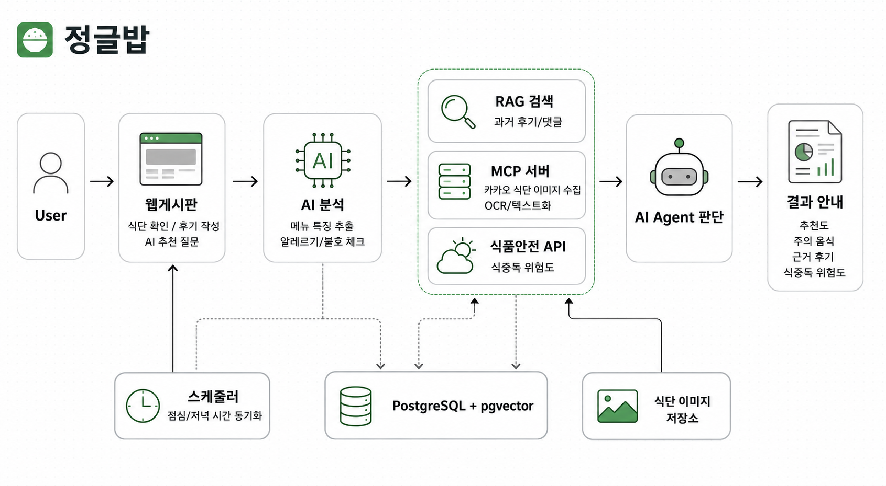
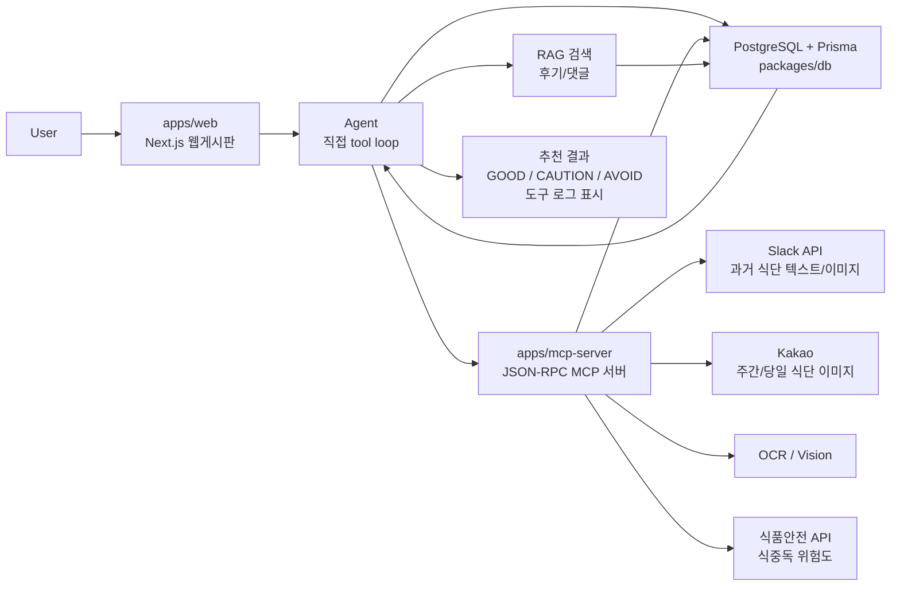

# 정글밥 아키텍처



## 한 줄 구조

```txt
User -> Next.js 웹게시판 -> Agent -> DB / RAG / MCP -> 개인화 추천 결과
```

## 전체 흐름



## Monorepo 구조

```txt
bob/
  apps/
    web/
      Next.js 웹앱
      게시판, 식단, 프로필, AI 추천 화면

    mcp-server/
      JSON-RPC 기반 MCP 서버
      Slack/Kakao 수집, OCR, 식중독 위험도 조회, DB 저장

  packages/
    db/
      Prisma schema/client 공유

    ai/
      RAG 검색, Agent 실행, OpenAI 호출 로직

  storage/
    menu-images/
    review-images/
```

## RAG 역할

RAG는 오늘 메뉴와 비슷했던 과거 후기/댓글을 찾아 AI 답변의 근거로 제공합니다.

RAG 검색 대상:

- `Review.title`
- `Review.content`
- `Review.menuNames`
- `Review.tags`
- `Comment.content`

RAG 검색 방식:

```txt
1. 메뉴명/태그 기반 정확 검색
2. `ReviewChunk.embedding Float[]` 기반 코사인 유사도 검색
3. 두 결과를 합쳐 중복 제거
4. 상위 3~5개를 Agent에 전달
```

RAG로 처리하지 않을 것:

- 오늘 메뉴 조회
- 사용자 알레르기 조회
- 평균 평점 계산
- 일반 게시판 CRUD
- MenuArchive 원문 식단표 검색

## MCP 역할

MCP는 정글밥 내부 CRUD가 아니라 외부 데이터 연동에 사용합니다. v1에서는 별도 JSON-RPC 서버로 구현하고, MCP 서버가 PostgreSQL에 직접 저장합니다.

v1 MCP tools:

```txt
import_slack_menu_history
- Slack 특정 채널에 누적된 식단 텍스트/이미지를 전체 import
- 몽키봇이 보낸 메시지 우선, 식단/중식/석식/메뉴/점심/저녁 키워드 보조

fetch_kakao_weekly_menu_image
- 매주 월요일 10:00~11:00 사이 Kakao 주간 식단표 이미지 조회

sync_weekly_menu
- 주간 식단표 이미지를 OCR/Vision으로 읽고 날짜+식사 단위로 MenuArchive 저장

sync_daily_menu_image
- 점심 11:00~12:00, 저녁 17:00~18:00 사이 당일 식단 이미지/텍스트 수집

extract_menu_from_image
- 식단 이미지 OCR/텍스트화

get_food_poisoning_risk
- 외부 식품안전/기상 기반 식중독 위험도 조회
```

스케줄러는 "언제 실행할지"를 담당하고, MCP tool은 "외부 데이터를 실제로 가져오는 일"을 담당합니다.

## Agent 역할

Agent는 하나의 대표 기능에 집중합니다.

```txt
"오늘 메뉴 나한테 괜찮아?"
```

Agent 실행 순서:

```txt
1. get_today_menu
2. get_user_food_profile
3. check_food_rules
4. search_similar_reviews
5. get_food_poisoning_risk
6. generate_final_answer
7. save_agent_logs
```

Agent 구현 원칙:

- LangGraph 라이브러리는 v1에서 사용하지 않음
- 직접 tool loop / step pipeline 구현
- 각 단계 결과를 Agent state에 저장
- 고정 step과 max step으로 무한 루프 방지
- AgentRun / AgentStep에 실행 로그 저장

## 추천 결과

```txt
GOOD
- 현재 정보 기준으로 큰 주의사항이 보이지 않음

CAUTION
- 불호, 매운맛, 식중독 위험도 등 주의 요소가 있음

AVOID
- 알레르기 또는 명확히 피해야 하는 조건과 충돌
```

화면에는 최종 결과와 함께 사용한 도구 로그를 간단히 표시합니다.

## 안전 원칙

- 알레르기 판단은 LLM 추론에만 맡기지 않음
- "먹어도 안전합니다" 같은 단정 표현 금지
- "현재 정보 기준", "주의가 필요합니다", "공식 식단표를 확인하세요" 같은 표현 사용

## DB 모델

```txt
User
Session
FoodPreference
MenuArchive
Review
Comment
Tag
ReviewTag
ReviewChunk
AgentRun
AgentStep
McpCallLog
```
